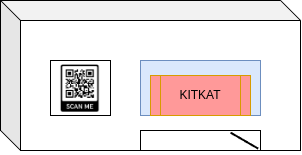

# Context
This vending machine should be of simple and fast usage, the main idea is to create make the payments in bitcoin with QR code

# Chores
- [ ] Create website for managing products
    - [ ] Make login 
    - [ ] Inform the mercado pago account to receive money
    - [ ] Create alerts
        - [ ] Inform when product is sold
        - [ ] Inform when machine is out of products
    - [ ] Sync account with physical device (by ip)

- [x] Create API
    - [x] CRUD for machines
    - [x] CRUD for products
    - [x] CRUD for transactions
- [ ] Create physical device
    - [ ] Make requests to list items
    - [ ] Show items for customer
    - [ ] Let user choose item
    - [ ] Generate PIX QR code with item price
    - [ ] Gets payment callback and give the item
